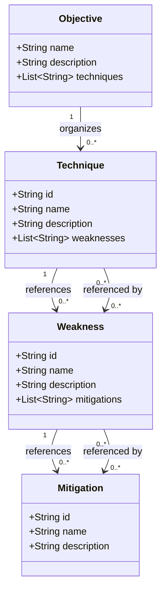

# SOLVE-IT Data Model Relationships

This document visualizes the relationships between the core data models in the SOLVE-IT knowledge base.

## Core Data Models

The SOLVE-IT knowledge base consists of four primary data models:

1. **Technique**: A digital forensic technique used in investigations
2. **Weakness**: A limitation or vulnerability of a technique
3. **Mitigation**: An approach to address or mitigate a weakness
4. **Objective**: A category or goal that organizes techniques (e.g., by investigation phase)

## Relationship Diagram

## Relationship Descriptions

### Forward Relationships

- **Technique → Weakness**: A technique can reference multiple weaknesses. This relationship is stored in the `weaknesses` attribute of the Technique model, which contains a list of weakness IDs.
- **Weakness → Mitigation**: A weakness can reference multiple mitigations. This relationship is stored in the `mitigations` attribute of the Weakness model, which contains a list of mitigation IDs.

### Reverse Relationships

- **Weakness ← Technique**: A weakness can be referenced by multiple techniques. This relationship is not stored directly but can be queried using the `get_techniques_for_weakness` method.
- **Mitigation ← Weakness**: A mitigation can be referenced by multiple weaknesses. This relationship is not stored directly but can be queried using the `get_weaknesses_for_mitigation` method.

### Objective Mapping Relationships

- **Objective → Technique**: An objective can organize multiple techniques. This relationship is stored in the `techniques` attribute of the Objective model, which contains a list of technique IDs.

## Query Methods

The KnowledgeBase class provides methods to query these relationships:

### Forward Relationship Queries

- `get_weaknesses_for_technique(technique_id)`: Get weaknesses associated with a technique
- `get_mitigations_for_weakness(weakness_id)`: Get mitigations for a weakness

### Reverse Relationship Queries

- `get_techniques_for_weakness(weakness_id)`: Get techniques that reference a weakness
- `get_weaknesses_for_mitigation(mitigation_id)`: Get weaknesses that reference a mitigation

### Objective Mapping Queries

- `list_objectives(mapping_name=None)`: List objectives from the specified or current mapping
- `get_techniques_for_objective(objective_name, mapping_name=None)`: Get techniques for an objective

## Data Storage

The data models are stored as JSON files in the following directory structure:

- `data/techniques/`: Contains JSON files for techniques (e.g., T0001.json)
- `data/weaknesses/`: Contains JSON files for weaknesses (e.g., W0001.json)
- `data/mitigations/`: Contains JSON files for mitigations (e.g., M0001.json)
- `data/`: Contains objective mapping files (e.g., solve-it.json, carrier.json)
